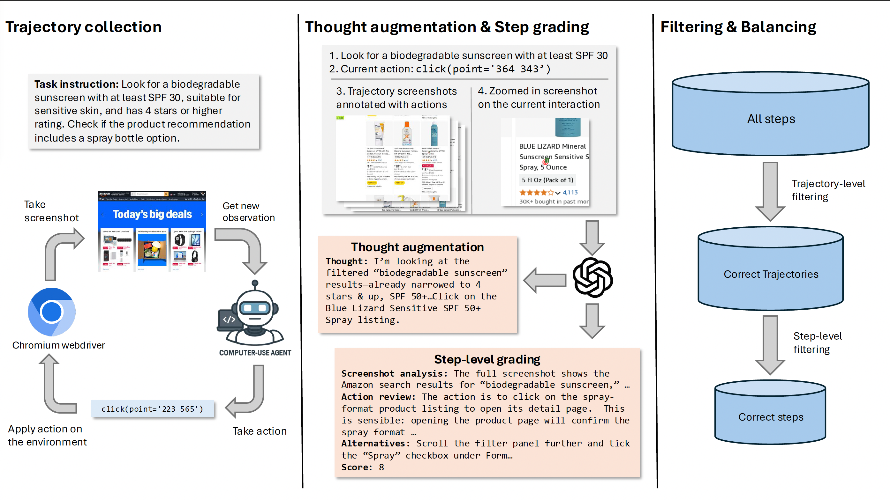

# Scalable Data Synthesis for Computer Use Agents with Step-Level Filtering
Yifei He<sup>\*1</sup>, Pranit Chawla<sup>\*2</sup>, Yaser Souri<sup>2</sup>, Subhojit Som<sup>2</sup>, Xia Song<sup>2</sup>

<sup>1</sup>University of Illinois Urbana-Champaign <sup>2</sup>Microsoft

<p align="center">
  <a href="https://arxiv.org/abs/2512.10962">
    </a>
  &nbsp;
  <a href="https://github.com/yifei-he/CUAStepFiltering">
    </a>
</p>

## News
- [2025.12] We will release our datasets WebSTAR and the trained models soon after the internal review process.
- [2025.12] Code and paper are released.



## Abstract
Computer use agents (CUAs) can operate real-world digital interfaces but remain difficult to train due to the high cost of graphical user interface (GUI) interaction and the scarcity of high-quality trajectory data. Existing datasets rely on human demonstrations, limiting scalability. A natural alternative is to synthesize data from strong CUAs, yet their rollouts are highly noisy, with incorrect or suboptimal actions consisting a large proportion of the steps, making naive imitation ineffective. To tackle this challenge, we introduce a scalable data synthesis pipeline that transforms noisy rollouts into reliable supervision without human annotation. The core idea is step-level filtering, which evaluates actions individually to retain only correct steps, complemented by reasoning augmentation for improved planning. Using this pipeline, we construct WebSTAR, a dataset of 13.3K trajectories and 100K graded, reasoning-rich steps synthesized from OpenAI's computer-use-preview model. We train Qwen-2.5-VL-Instruct models (7B and 32B) on WebSTAR. On WebVoyager, our 7B model surpasses SoTA open-source CUA model UI-TARS-1.5-7B by more than 15% with only supervised finetuning. Building on step-level grading, we further create WebSCORE, a dataset of graded step-level actions, and train StepRM, a 7B multimodal reward model distilled from o4-mini, which matches its grading quality while being far more efficient to deploy at scale. Our results establish step-level filtering as a key principle for scalable CUA training and construct two new datasets (WebSTAR, WebSCORE) and a lightweight reward model (StepRM) as practical tools to advance robust and efficient CUAs.

## Environment
To setup the WebVoyager environment in conda, 
```
conda create -n cua
pip install selenium
pip3 install torch torchvision torchaudio
pip install qwen-vl-utils
pip install datasets
pip install openai -U
pip install vllm -U
pip install -U flash-attn --no-build-isolation
```

Next, install chromium, which is the web environment that WebVoyager uses. Download the chrome installer, and run
```
sudo apt --fix-broken install <path-to-folder>/google-chrome-stable_current_amd64.deb
```
Then you would also need to install playwright, which is the package for carrying out actions in the environment
```
playwright install chromium
```

## VLLM Hosting
For open models without API, you will need to host it on VLLM for maximum throughput. 7B models can be hosted on a single 80G A100 GPU. To do so,
```
bash scripts/launch_vllm_servers.sh <your_model_path>
```
The default model to host is `ByteDance-Seed/UI-TARS-1.5-7B`.

Then, after making sure the model is successfully running (it's consuming GPU memory), launch flask router
```
python flask_router.py
```

## Data collection
The both data collection and evaluation, all the queries are stored in `./data`. The final version I used to collect openwebvoyager data is `openwebvoyager_full_clean.jsonl`. Similarly, all other names ending with 'clean' means that I have filtered out some outdated or invalid tasks.

To collect rollouts for GPT-4o based CUA on openwebvoyager queries, run the following command
```
bash scripts/openwebvoyager_cua.sh
```
You can optionally collect rollout with open models or your own checkpoints such as
```
bash scripts/openwebvoyager_uitars.sh # UI-TARS-1.5-7B
```

## Data annotation
The data annotation is step-wise, so everything is in `./step_eval`.

The following steps need to be done sequentially. The first step is to annotate the screenshots with actions:
```
cd step_eval
python data_visualization_full.py             # For OAI CUA
```

Second, evaluate the correctness of the trajectories. Please change the folder name to evaluate in the script.
```
cd evaluation
bash run_oai_cua_eval_parallel.sh
```

Third, we can generate the thought and grades for each step. To do so,
```
cd step_eval
bash scripts/4ocua.sh
```
There are three important arguments in the annotation
```
--process_dir: The folder to do the annotation
--finished-only: Only annotate the finished trajectories
--correct-only: Only annotate the correct trajectories, run the evaluation command in the next section first to get the correct trajectories
```
You can use the latter ones if you only want to annotate a subset to save time.

## Evaluation
All evaluation files are in `./evaluation`. There are mutliple files each implemented for different output format. All of those use GPT-4o as a judge which take in 50 latest screenshots in the trajectory and the final answer. For WebVoyager evaluation, do three steps. First host the model through VLLM as shwon above. Second, collect the trajectories given queries.
```
bash scripts/eval_uitars_parallel.sh
```
Third, use GPT-4o for grading the trajectory.
```
cd evaluation
bash run_oai_cua_eval_parallel.sh
```
You might need to run this command before data annotation if you want to only grade the correct trajectories.

## Citation
```
@misc{he2025scalabledatasynthesiscomputer,
      title={Scalable Data Synthesis for Computer Use Agents with Step-Level Filtering}, 
      author={Yifei He and Pranit Chawla and Yaser Souri and Subhojit Som and Xia Song},
      year={2025},
      eprint={2512.10962},
      archivePrefix={arXiv},
      primaryClass={cs.LG},
      url={https://arxiv.org/abs/2512.10962}, 
}
```